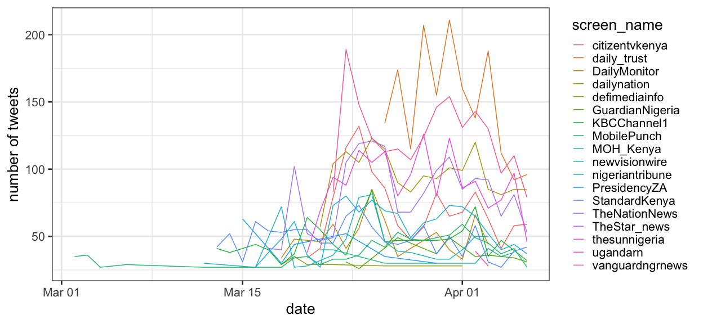

COVID19 Africa response
================
06 April, 2020

Load csv of twitter
handles,

``` r
news_sites <- read_csv('data/africa_news_sites_4_6_2020.csv', na = c("null",""," ")) %>%
  set_names(c("news_url", "twitter_handle"))
```

    ## Parsed with column specification:
    ## cols(
    ##   `News sites` = col_character(),
    ##   `Twitter Handle` = col_character()
    ## )

``` r
print(news_sites)
```

    ## # A tibble: 152 x 2
    ##    news_url                                   twitter_handle 
    ##    <chr>                                      <chr>          
    ##  1 https://af.reuters.com/                    @ReutersAfrica 
    ##  2 https://www.bloomberg.com/africa           @BBGAfrica     
    ##  3 https://apnews.com/apf-africa              @AP_Africa     
    ##  4 https://www.cnn.com/africa                 @CNNAfrica     
    ##  5 http://www.aps.dz/en/                      @EnglishAps    
    ##  6 https://www.bbc.com/news/world/africa      @BBCAfrica     
    ##  7 http://www.elmoudjahid.com/en              <NA>           
    ##  8 https://algeria-watch.org/?cat=33          <NA>           
    ##  9 http://algeriatimes.info/index.php?lang=en <NA>           
    ## 10 https://times-of-algeria.com/              @TimesofAlgeria
    ## # … with 142 more rows

To search the handles we need to strip the “@”, look up user, and
collect the data,

``` r
# clean and prepare handles
handles <- news_sites %>%
  mutate(handle = str_remove(twitter_handle,"@")) %>% # remove @
  drop_na(handle) %>% # remove rows without handles
  pull(handle) # extract handle column

# search twitter posts from handles
twitter_timeline <- get_timelines(handles, n=3200) 

# clean post for analysis 
twitter_posts <- twitter_timeline %>%
  mutate(text=tolower(text)) %>%
  filter(stringr::str_detect(text, 'corona|coronavirus|virus|novel|covid|covid-19|pandemic')) %>%
  select(created_at,screen_name,text,favorite_count,retweet_count,
         hashtags, linked_url=urls_expanded_url) %>% # select specific columns
  unnest(linked_url) %>% # convert url from list to column
  mutate(hashtags = set_names(hashtags, screen_name), # add names to list
         hashtags = map(hashtags, str_c, collapse=", ")) %>% # create char string
  unnest(hashtags) # convert list to column 

# write_csv(twitter_posts %>% slice(1:100),"data/twitter_url_sample.csv")
```

Plot tweets through time,

``` r
twitter_posts <- read_csv("data/twitter_url_complete.csv")
```

    ## Parsed with column specification:
    ## cols(
    ##   created_at = col_datetime(format = ""),
    ##   screen_name = col_character(),
    ##   text = col_character(),
    ##   favorite_count = col_double(),
    ##   retweet_count = col_double(),
    ##   hashtags = col_character(),
    ##   linked_url = col_character()
    ## )

``` r
twitter_posts %>%
  mutate(date = lubridate::as_date(created_at)) %>%
  group_by(screen_name, date) %>%
  count() %>%
  filter(n > 25) %>%
  ggplot() +
  geom_line(aes(date,n,color=screen_name)) + 
  labs(y="number of tweets")
```

<!-- -->
Download text from one
webpage,

``` r
webpage <- read_html('https://www.nation.co.ke/news/Four-more-test-positive-for-Covid-19-/1056-5508262-mkqe0ez/index.html') %>%
   html_nodes(xpath='/html/body/article/section[2]/section[2]/div/div/article/div/article/section[2]/div[1]/p') %>%      
        html_text() 

print(webpage)
```

    ## [1] "Four more people have tested positive for coronavirus, bringing the total number of confirmed positive cases to 42."
